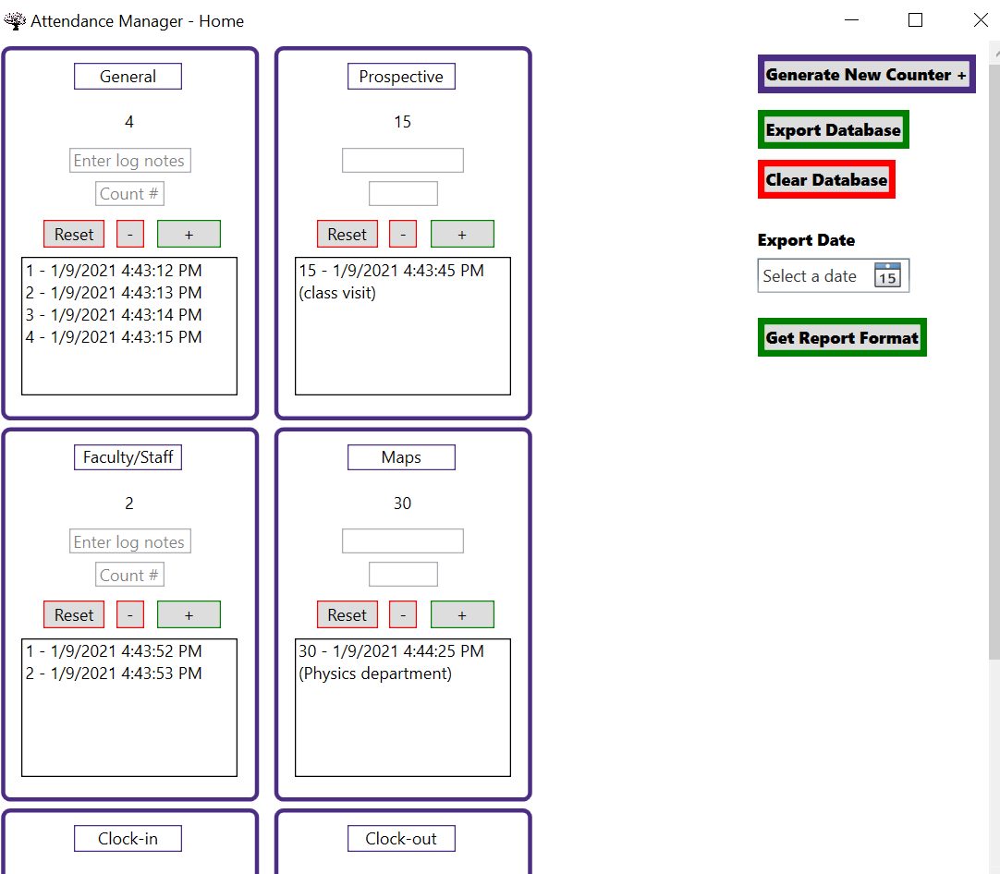
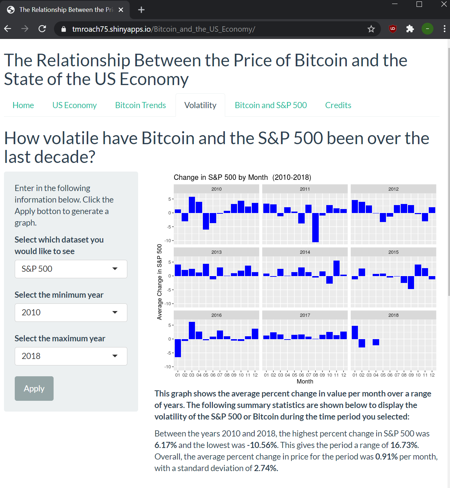

# Timothy Roach

- Email: tmroach@uw.edu
- LinkedIn: https://www.linkedin.com/in/timothy-roach-b3533814a
- GitHub: https://github.com/tmroach

# Summary

> I am a senior at the University of Washington majoring in Geography: Data Science with a minor in Informatics. I have experience building applications in Java, C#, Python, and R, and am seeking a software engineering internship to further develop my skills before entering the industy full time.

# Education

**B.A. Geography: Data Science**
University of Washington -- Seattle, WA
Expected Graduation: December 2021
**Relevant Coursework**: Computer Programming I & II, Intermediate Programming, Data Structures & Algorithms, Algorithms & Computational Complexity, Database Systems, Data Wrangling in R, Design Methods, Artificial Intelligence

# Selected Programming Experience

[<b>Attendance Tracker</b>](https://github.com/tmroach75/AttendanceTracker) | UW Visitor Center | June 2020 – September 2020
-	Built a .NET Core WPF application to replace the previous attendance tracking tool used by the UW Visitor Center
-	Used XAML and C# to program the app's functionality
-	Connected app to an SQLite database to store data on disk, and to allow data to be organized and exported in CSV format
-	App reduces previous data reporting process from over an hour to a few minutes

\
\

[<b>Bitcoin & the US Economy</b>](https://tmroach75.shinyapps.io/Bitcoin_and_the_US_Economy/) | Course Capstone | March 2020
-	Developed a data visualization web application to investigate to what extent the S&P 500 affects Bitcoin prices
-	Wrote a data report in R Markdown to conduct the initial analysis of the data sets
-	Demonstrated proficiency in version control systems by collaborating with teammates to commit changes and resolve merge conflicts

# Work Experience

**Visitor Center Assistant** | University of Washington | August 2019 – Present
-	Serve as the first point of contact for campus visitors, practicing excellent customer service during in-person conversations, phone calls, and in emails
-	Wrote content for the new Visitor Center website, which will be released in winter 2021
-	Utilized ArcGIS Online to create routes and story maps to prototype tours the Visitor Center will implement after the COVID-19 pandemic

**User Researcher** | Independent Contractor | June 2019 – July 2019
-	Collaborated with team members to identify elements negatively impacting the appointment booking performance of a chiropractic website
-	Conducted over 25 user interviews in-person and through video calls to collect user feedback
-	Organized user feedback in a spreadsheet to increase our ability to gain insights from the data

# Volunteer Experience

**Assistant Director of Representation** | Willow Hall Council | October 2018 – June 2019
-	Supervised ten residence hall representatives across seven campus organizations
-	Created a culture of collaboration and community involvement by facilitating weekly representative meetings
-	Managed a group of 15 volunteers to organize an event with a set budget, and attracted over 300 attendees to the event
